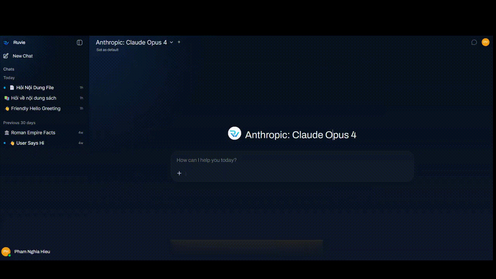

# Ruvie Assistant


Ruvie Assistant is a customized, self-hosted AI chat model.

## Demo


## Current Stack

- Frontend: SvelteKit, Vite, TypeScript.
- Backend: FastAPI in `backend/ruvie`.
- Database: SQLite by default at `backend/data/webui.db`; PostgreSQL is supported through `DATABASE_URL`.
- Static assets: served from `static/static`.
- UI languages: Vietnamese, Russian, and English (US) only.

## What This Repo Covers

- Chat UI and multi-model conversations.
- File upload, knowledge bases, and RAG.

## Run Locally

Prereqs:

- Python 3.11+
- Node.js 18.13+

Backend:

```powershell
.\.venv\Scripts\uvicorn.exe ruvie.main:app --app-dir backend --host 127.0.0.1 --port 8080 --reload
```

Frontend:

```powershell
.\node_modules\.bin\vite.cmd dev --host 0.0.0.0
```

Open:

- Frontend: `http://localhost:5173`
- Backend API: `http://127.0.0.1:8080`
